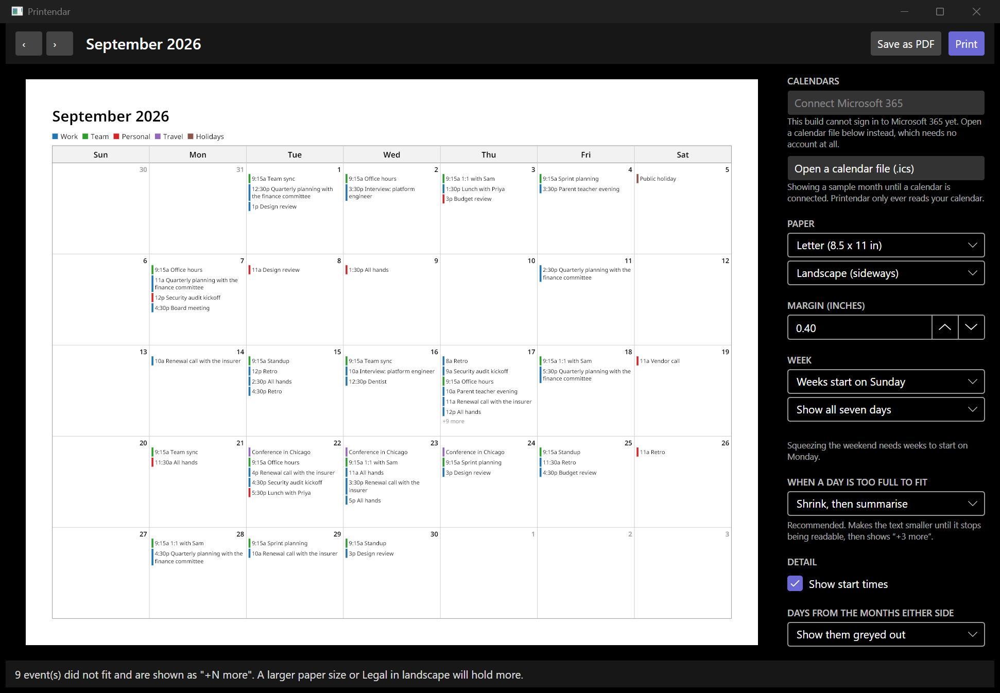
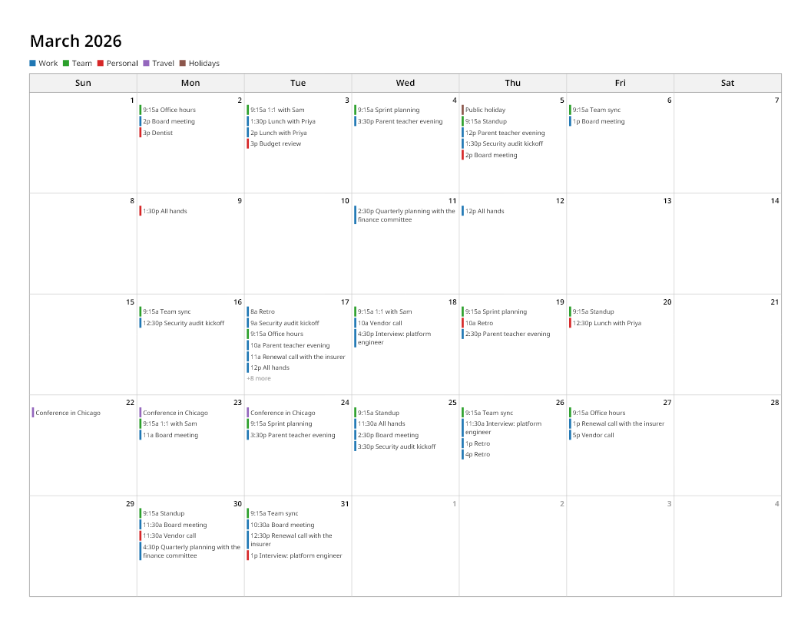
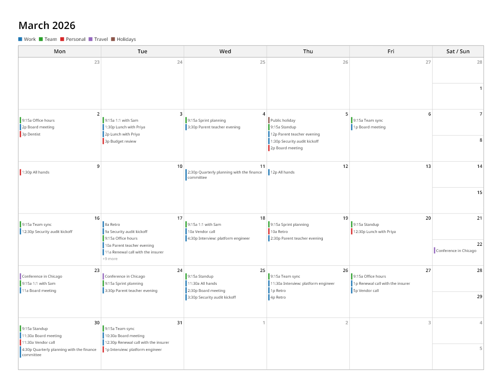
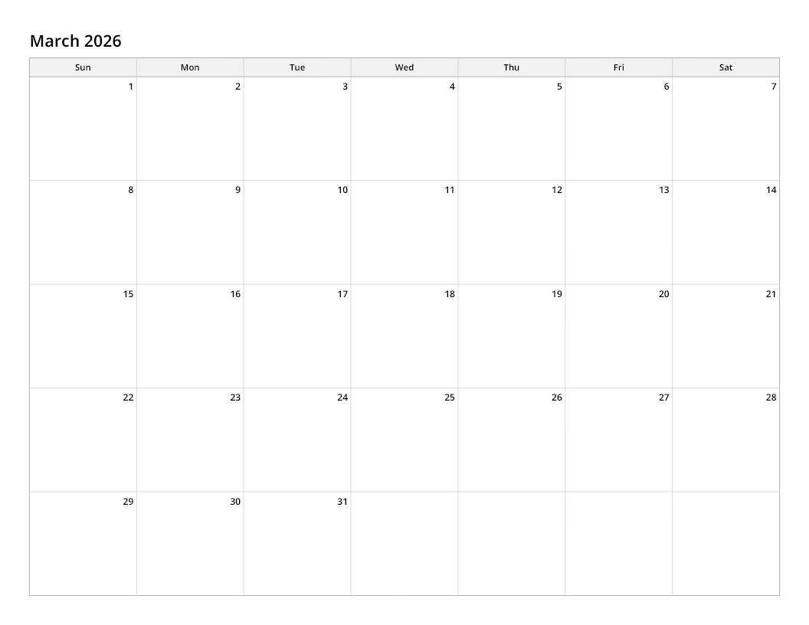

# Printendar

**Print a calendar month on a single landscape sheet, the way classic Outlook could.**

A desktop app that lays a month out against the real dimensions of the paper, so it fits on
one page instead of spilling onto two.

[](https://github.com/levinium/Printendar/releases/latest)
[](https://github.com/levinium/Printendar/releases)

[](https://github.com/levinium/Printendar/actions/workflows/ci.yml)



## Download

**[Download Printendar-v0.1.0-win-x64.zip](https://github.com/levinium/Printendar/releases/latest)**

Unzip it anywhere and run `Printendar.exe`. That is the whole installation. No setup step, no
admin prompt, no registry entry: the .NET runtime it needs is inside the folder. Delete the
folder and it is gone. You need 64-bit Windows and nothing else.

This is an early release. Read [what works and what does not](#status) before you download.

## Why this exists

Classic Outlook could do this. File > Print, Monthly Style, Page Setup, landscape, one page.

New Outlook and Outlook on the web cannot. Their print path offers no orientation control and
no page-fitting control, so a month with real events on it spills onto two pages whatever you
choose. Microsoft's current answer to people asking for it is to switch back to classic
Outlook, and classic Outlook is being retired.

## What it does

### It measures the page before it draws

This is the part that makes the guarantee real. Printendar works out how much room each day
cell has, measures every event title in the font it will actually be printed in, and searches
for the largest text size at which the whole month still fits.

It stops shrinking at the point the text stops being readable on paper. Anything still left
over becomes a "+3 more" note rather than being silently clipped. Either way you get one page,
and the trade-off it made is reported to you in words rather than discovered at the printer.



### It merges several calendars onto one grid

Each calendar gets its own colour and a printed legend. Colours are chosen to stay
distinguishable for the common forms of colour blindness, and each one carries a coloured bar
rather than a filled block so the page still reads when printed in black and white.

### It can squeeze the weekend

Saturday and Sunday share one narrower column, stacked, which buys the five days that usually
carry the events about a fifth more width. There is also a weekdays-only mode.



### It prints a blank month too

A plain grid with the right dates and no events, which is another thing people specifically
complain about losing from new Outlook.



### The preview is the page

The preview is not an approximation. It draws the same laid-out page object the PDF exporter
writes, through the same renderer, so what is on screen is what comes out. There is no second
rendering path to drift.

## Connecting a calendar

### A calendar file, needing no account

Export or download a calendar as a `.ics` file from Outlook, Google Calendar, Apple Calendar
or anything else that speaks iCalendar, then **Open a calendar file**. Recurring events,
all-day events and exceptions are all handled. The file is read fresh each time, so
re-exporting and printing again picks up changes.

This route needs no sign-in, no network and no approval from anybody.

### Microsoft 365

Not in the downloadable build yet. The code is written and tested, but signing in needs an
Entra application registration that has not been created, so the button is disabled rather
than failing after you click it.

If you want to run it against your own registration:

```powershell
scripts/New-PrintendarAppRegistration.ps1     # creates one
$env:PRINTENDAR_MS_CLIENT_ID = '<your client id>'
```

It asks only for read access to calendars, and the token is stored encrypted by your operating
system: DPAPI on Windows, Keychain on macOS, libsecret on Linux. Nothing is sent anywhere
except to Microsoft.

## Status

Early, and honest about it.

**Works:** the layout engine, the desktop window with a live preview, PDF export, and reading
`.ics` files.

**Not built yet:**

- Microsoft 365 sign-in needs an application registration, as above.
- Google Calendar, and `.ics` subscription URLs (files only for now).
- Printing hands the PDF to your system's own viewer and print dialog rather than driving the
  printer directly. The page size is baked into the PDF, so the dialog opens already set to
  landscape.
- Only the month view. A week, an agenda and a tri-fold are planned.
- A multi-day event repeats as a chip on each day it covers, rather than drawing as one
  spanning bar.
- The window has only been run on Windows. The engine underneath is built and tested on
  Windows, macOS and Linux by CI, but nobody has opened the app itself on a Mac.

## Before you print a lot of them

Print one and look at it. The layout is measured against the paper, but your printer has its
own unprintable margin near the edges, and only a real sheet tells you whether the default
0.4 inch margin clears it.

## Building from source

Needs the .NET 10 SDK.

```powershell
dotnet test          # 201 tests, all three platforms in CI
./publish.ps1        # builds dist\Printendar-v0.1.0-win-x64.zip
```

`publish.ps1` runs the tests first and refuses to publish if any fail.

There is also a headless harness, useful for looking at the output without the window:

```powershell
dotnet run --project src/Printendar.Cli -- render --month 2026-03 --demo --out march.pdf --png march.png
```

## How it is put together

```
src/Printendar.Core/                 paper, layout, the scene graph, rendering, PDF export
src/Printendar.Sources.Microsoft365/ Microsoft Graph and MSAL
src/Printendar.Sources.Ics/          iCalendar files
src/Printendar.App/                  the Avalonia window
src/Printendar.Cli/                  headless harness
tests/                               run on Windows, macOS and Linux
```

### The design that matters

Layout is arithmetic over measured text. Rendering is a switch statement. One class touches a
pixel.

Everything that can fail, meaning "does this fit on one page", happens in pure code a unit test
can interrogate without producing a bitmap. That is why this uses Skia directly rather than
HTML or XAML: asking a general-purpose layout engine not to paginate is asking for a guarantee
it does not offer, and you find out at the printer. Measuring glyph runs and packing them into
a fixed content box turns the requirement into an assertion.

Layout produces an immutable `ScenePage`: fully resolved nodes in page coordinates, every
string a single line that already fits. The preview draws that object, the PDF exporter writes
that object, and the printer gets that object. There is no second layout pass to drift.

### The font is embedded, deliberately

Noto Sans ships inside `Printendar.Core` and is used instead of a system font. Glyph advances
decide where a title wraps and therefore how tall a cell must be, so a system font would make
the same month fit on one machine and spill on another. CI runs the layout tests on Windows,
macOS and Linux and they assert exact geometry, which is what turns that from an intention into
a measured fact.

### Why the tests are shaped the way they are

The invariant suite lays out every month across four paper sizes, both orientations, both week
starts and all three weekend modes, and asserts that no drawn element falls outside the sheet.
There is a deliberately pathological case too: 500 events in one month with 400-character
unbroken subjects at 0.15 inch margins. It still produces one page.

`FitIsMonotoneInScale` walks the whole type-size ladder. The fit search is a binary search, and
that is only valid while shrinking the text cannot increase the number of wrapped lines. It
stops being valid the moment someone expresses a padding in fixed points while the fonts scale,
so this test exists to catch exactly that.

`ArchitectureTests` parses `Printendar.Core.csproj` as XML and asserts its package references
are exactly SkiaSharp. Asserting on `TargetFrameworkAttribute` would be true by construction
and prove nothing, and `GetReferencedAssemblies` can pass vacuously because the CLR omits
references the JIT never needed.

## Third-party components

| Package | Licence | Used for |
| --- | --- | --- |
| SkiaSharp | MIT | measuring text, drawing, PDF export |
| Avalonia | MIT | the desktop window |
| Ical.Net | MIT | reading `.ics` files and expanding recurrence |
| Microsoft.Identity.Client | MIT | signing in to Microsoft 365 |
| Noto Sans | SIL OFL 1.1 | the embedded layout font |

## Licence

MIT. See [LICENSE](LICENSE).
